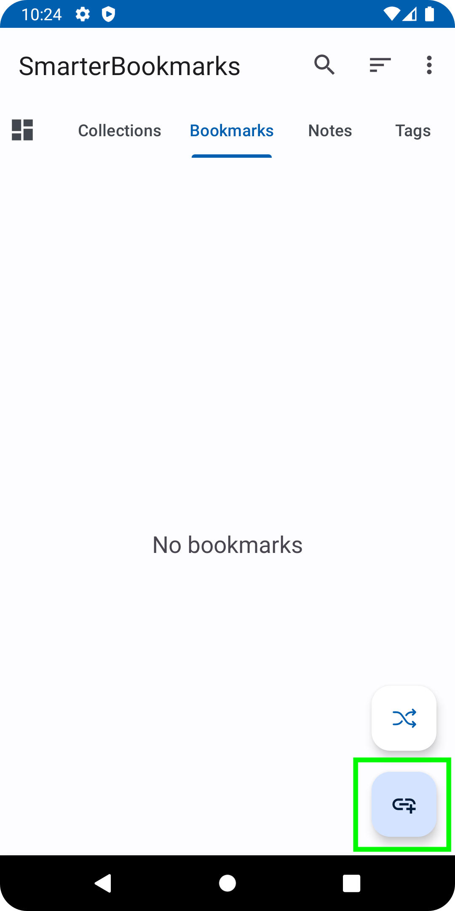
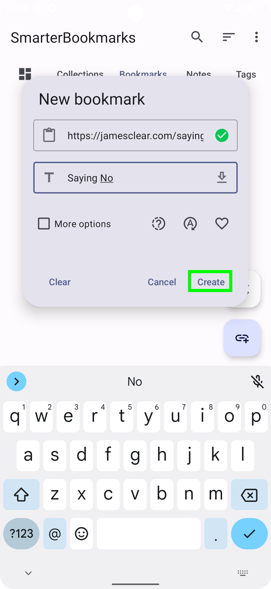
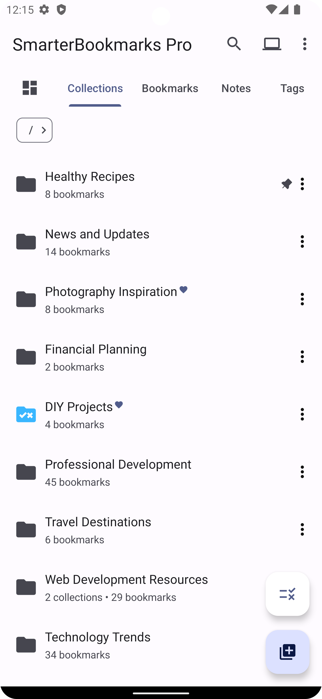
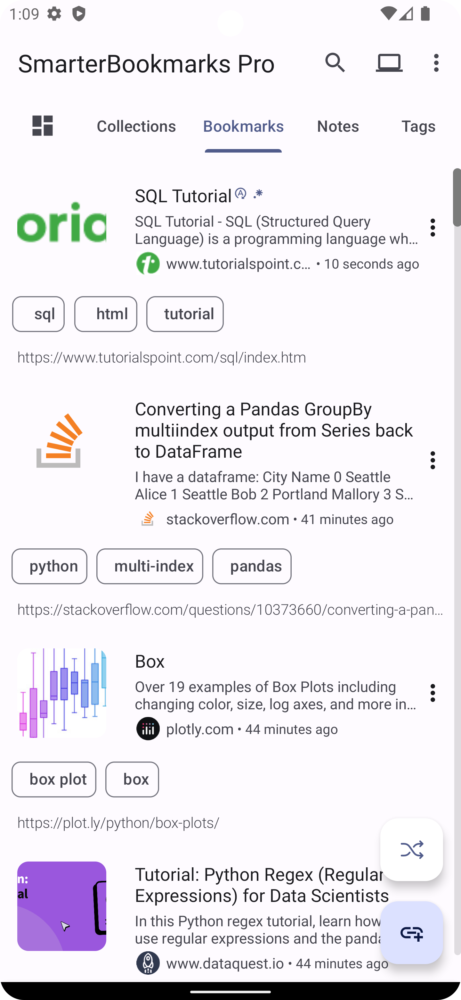

# Getting Started with SmarterBookmarks

Welcome to SmarterBookmarks! This guide will help you get started and make the most out of our app for organizing and managing your bookmarks.

## Table of Contents

1. [Installation](#installation)
2. [Adding Bookmarks](#adding-bookmarks)
3. [Organizing Bookmarks](#organizing-bookmarks)
4. [Searching and Filtering](#searching-and-filtering)
5. [Syncing Across Devices](#syncing-across-devices)
6. [Settings](#settings)
7. [Troubleshooting](#troubleshooting)

## Installation

SmarterBookmarks is available only on Android. Visit [Google Play](https://play.google.com/store/apps/details?id=com.smarter.technologist.android.smarterbookmarks) to download and install it on your device.

## Adding Bookmarks

Now that you have installed SmarterBookmarks, let's start adding bookmarks.

There are various ways to add bookmarks[^1]. The default way is through the app itself. To do this:

1. Open the app.
2. On the "Bookmarks" tab, click on the "+" button.
3. Enter the URL of the website you want to bookmark.
4. Add a title and other bookmark info[^2] if desired.
5. Click "Create."

## Organizing Bookmarks

Keep your bookmarks organized for easy access:

1. Create collections to categorize your bookmarks.
2. [Smart Collections](pages/SMART.md) (Pro feature) allow you to specify a set of criteria for bookmarks to be contained in the collections, to make keeping track of bookmarks much easier
3. Use tags to label bookmarks with keywords, making them easily searchable.

## Searching and Filtering

Efficiently find your bookmarks:

1. Utilize the search bar to quickly locate specific bookmarks.
2. Apply filters based on tags, status, pinned, or favorites.

## Syncing Across Devices

Access your bookmarks from any Android device:

1. Ensure you are logged in to the same Google account on all devices.
2. Enable cloud syncing in the app settings.

## Settings

Explore additional features and customize your experience:

1. Access the settings menu.
2. Adjust preferences such as theme, security settings, AI classification, behavior, etc.

## Troubleshooting

Encountering issues? Here are some tips:

- Check your internet connection.
- Ensure you are using the latest version of the app.
- If you need personalized assistance or have a specific issue that needs attention, you can request support via email:
    1. Click on the "Send Feedback" option in the About section of the app's settings.
    2. Provide a detailed description of the issue you are facing.
    3. Click "Submit" to send a support request.
    4. Our support team will get back to you via email as soon as possible.

That's it! You're all set to make the most of SmarterBookmarks. Happy bookmarking!

[^1]: You can also add bookmarks by sharing links from other apps or by importing them via HTML exports from browsers
[^2]: Bookmark info includes adding as a favorite, adding tags, adding to a collection, setting a status, configuring how to auto-refresh bookmark metadata, adding a reminder (Pro feature), and setting a bookmark as dynamic.
