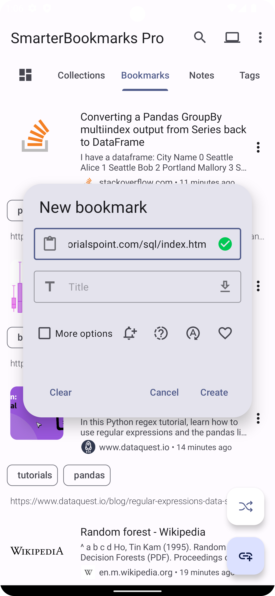
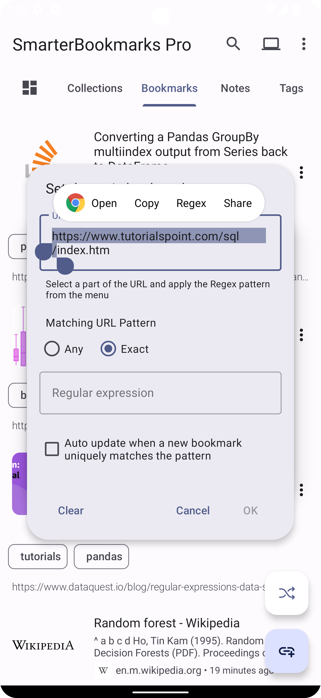
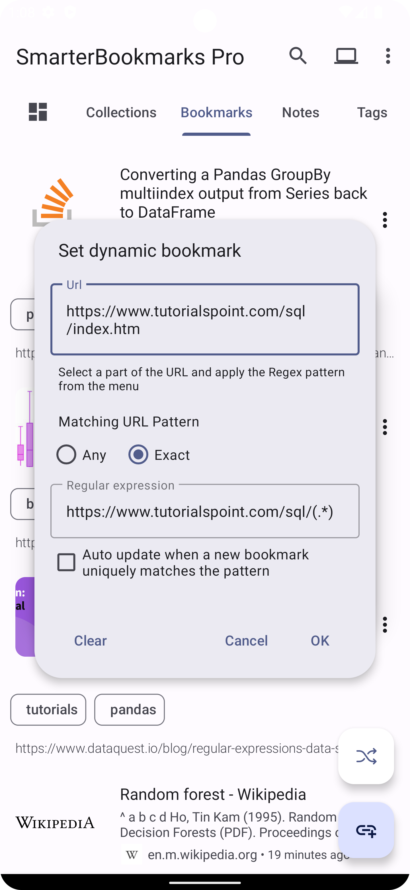
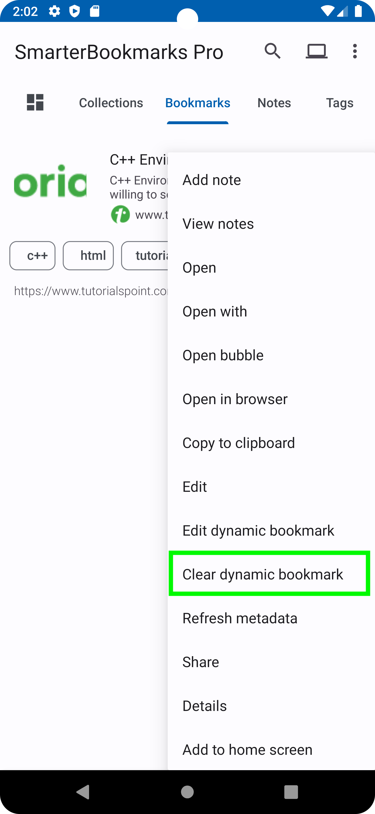

# Dynamic Bookmarks

You can create dynamic bookmarks that can be auto-updated based on the criteria you specify based on the URL.

This is especially useful if you do not want to create a lot of bookmarks about a particular topic when all you require is just **ONE** up-to-date bookmark. For example, comics, weekly podcasts, TV shows, documentation pages you last read, YouTube playlists, articles in blogs you last read, etc. This feature lets you track your journey through a website.

## Creating/Setting a Dynamic Bookmark

There are currently two criteria when setting up dynamic bookmarks:

* ANY
* EXACT

ANY matches any URL while EXACT uses Regular expressions to match a URL.

For example, given the following URL <https://www.tutorialspoint.com/cplusplus/index.htm> as a starting point, we can create this bookmark using the EXACT match. This is done by highlighting a portion of the URL as shown below. Then select Regex from the popup menu which creates the following regex `https://www.tutorialspoint.com/cplusplus/(.*)`.

When we're done visiting this page, we can navigate to another URL similar to the first one for example <https://www.tutorialspoint.com/cplusplus/cpp_overview.htm>. Since this is a dynamic bookmark, an update menu icon is shown which lets us update the bookmark to the current URL.

This update will work because it matches the specified regex.

#### Further example

    
    
    

## Removing a Dynamic Bookmark

To unset a dynamic bookmark, simply click on the bookmark options and select "Clear dynamic bookmark."

