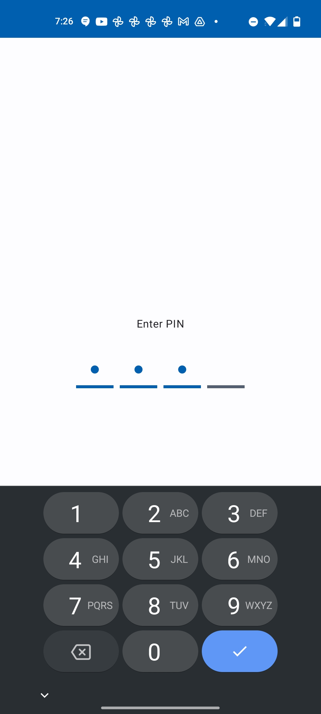

### Locked Collections

#### Keep Your Bookmarks Secure

Locked Collections let you safeguard sensitive data by requiring authentication to access them. With flexible security options, you can use your device's screen lock (e.g., fingerprint, face unlock, or PIN) or define a unique PIN within the app for enhanced privacy.

---

#### Key Features:
- **Enhanced Privacy**: Secure specific collections without impacting others.
- **Flexible Security**: Choose between **Screen Lock** (device lock) or a custom **App PIN** for unlocking.
- **Seamless Management**: Lock new or existing collections without disrupting your workflow.
- **Customizable Settings**: Adjust security preferences under `Settings -> Security -> Lock Type`.

---

#### How to Use Locked Collections:

1. **Set Up Your Lock Type**  
   - Go to `Settings -> Security -> Lock Type`.  
   - Choose between:
     - **Screen Lock**: Uses your device’s existing lock mechanism (e.g., fingerprint, face unlock, or device PIN).  
     - **PIN**: Set a unique app-specific PIN. If you select PIN and haven't set one yet, you'll be prompted to create it when locking your first collection.

   ⚠️ **Note**: By default, **Screen Lock** is enabled. If you select **PIN** but don’t set it up, you'll see a prompt to create a PIN the first time you attempt to lock a collection.

    
    

2. **Lock an Existing Collection**  
   - Navigate to your **Collections** tab.  
   - Find the collection you want to lock.  
   - Tap the **context menu** (three dots) next to the collection name.  
   - Select **"Lock"**.  
   - Enter your authentication to lock the collection.

    
     
      

3. **Create a New Locked Collection**  
   - Tap the **+** button in the **Collections** tab to create a new collection.  
   - After naming it, tap the **context menu** (three dots) next to the collection.  
   - Select **"Lock"** and authenticate as before.

4. **Access a Locked Collection**  
   - Tap on the locked collection in the **Collections** tab.  
   - Authenticate using your selected method (Screen Lock or PIN).  
   - Once authenticated, the collection unlocks, and you can access and manage bookmarks as usual.

    
    
     

5. **Unlock a Locked Collection**  
   - Tap on the locked collection.  
   - Authenticate using your selected method (Screen Lock or PIN).  
   - Access and manage bookmarks as usual.

    
    
    

6. **Manage Security Settings**  
   - To change the lock type or PIN, go to `Settings -> Security -> Lock Type`.  
   - Update your preferences or set a new PIN as needed.

---

#### Perfect For:
- Safeguarding confidential work links.  
- Securing sensitive personal information.  
- Hiding distractions during focus hours.
