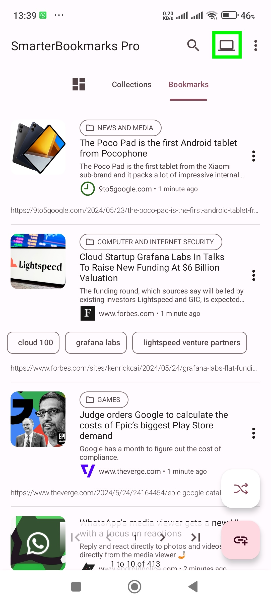
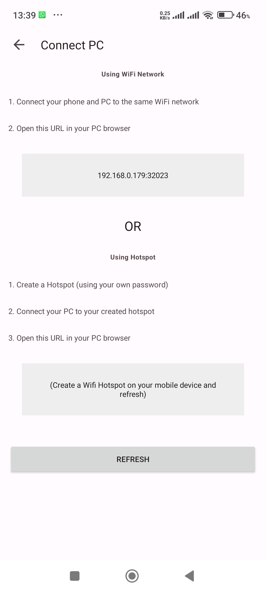
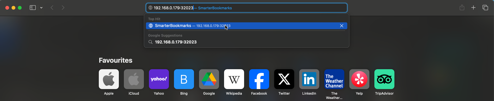
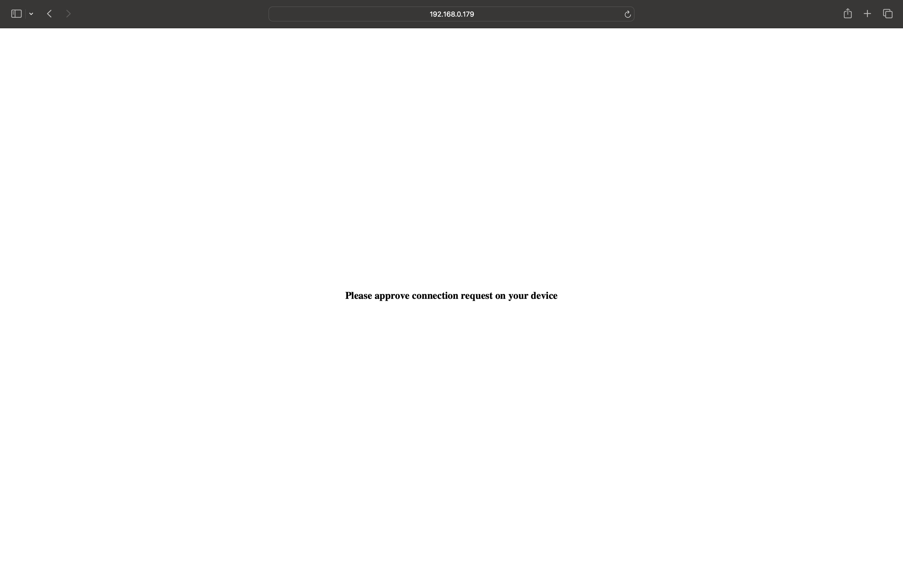
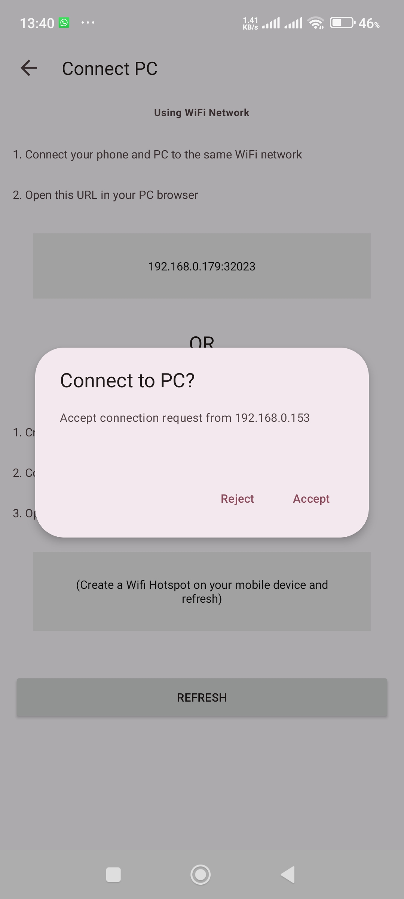
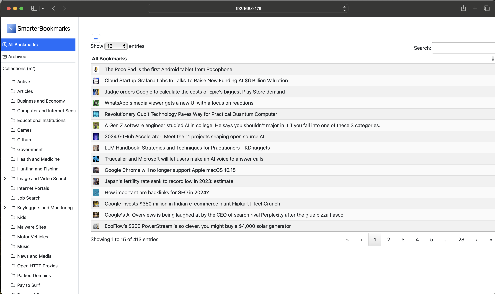

# Connect to PC

Take your bookmarks to the next level with our Connect to PC Pro feature. This powerful upgrade lets you effortlessly access and manage your meticulously curated collection directly from your computer. Your bookmarks are always at your fingertips, no matter which device you're using.

**Imagine this:** you're browsing on your phone and stumble upon an article you want to revisit later. With the Connect to PC feature, simply save it to SmarterBookmarks and then – bam! – it's readily available on your PC whenever you need it. No more frantically searching your phone history or relying on unreliable email hacks.

## Features
- **Local Wi-Fi Network:** Access bookmarks directly on your computer, no internet connection needed!
- **Manage Your Data:** View & edit your saved bookmarks, archived content, and organized collections.
- **Powerful Search:** Easily find what you're looking for within your bookmark collection.
- **Seamless Navigation:** Utilize pagination for effortless browsing through your saved items.

As outlined above, Connect to PC Pro offers a smooth and secure connection, ensuring your bookmarks stay organized and accessible across all your devices. Powerful search functionality and pagination let you navigate your collection with ease.

The Connect to PC Pro feature in SmarterBookmarks lets you conveniently view and manage your saved content directly on your computer, all within your local Wi-Fi network. **No internet connection required!** 

## How it works

1. **Connect to the Same Wi-Fi:** Ensure both your mobile device and PC are connected to the same Wi-Fi network. Alternatively, you can create a mobile hotspot on your device and connect your PC to it.

    
    

2. **Access App-Provided URL:** Open a web browser on your PC and navigate to the specific URL displayed within the SmarterBookmarks app.

    

3. **Approve the Connection:** A confirmation request will appear on your mobile device. Simply approve the request to establish the connection.

    

    
    

   

**Congratulations!** Your bookmarks are now accessible for viewing on your PC. Utilize the search function and pagination features to navigate your collection with ease.

    

