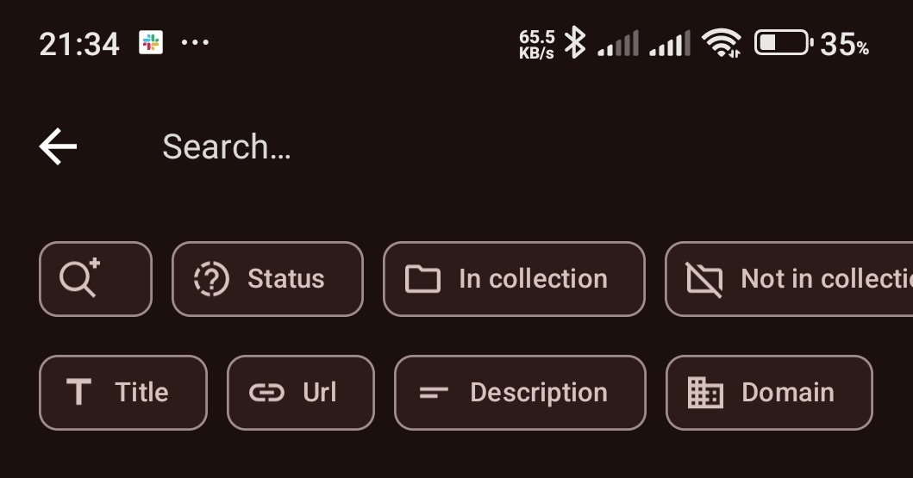
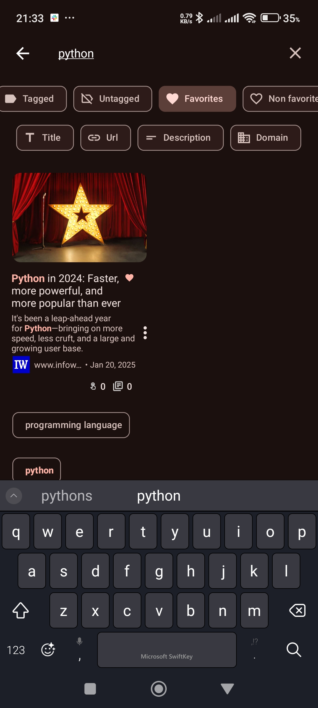
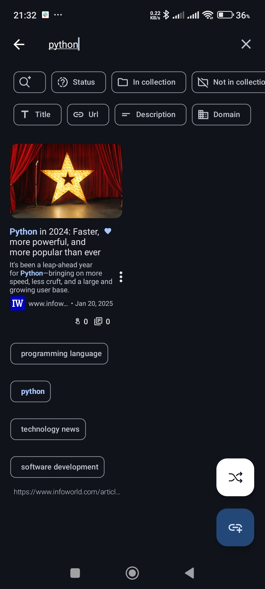

# Search Feature

The **Smarter Bookmarks** app offers powerful search and filtering capabilities across **Bookmarks**, **Collections**, **Notes**, **Tags**, and **Sources**. You can quickly find the items you're looking for and filter them based on various criteria.

## Basic Filters

The search feature allows you to filter and narrow down your results using several filters:

- **Favorites**: Show only bookmarks, collections, or notes marked as favorites.
- **Non-Favorites**: Show only those that are not marked as favorites.
- **Pinned**: Show only items that are pinned.
- **Unpinned**: Show only items that are unpinned.
- **AND/OR Chips**: Choose whether your search terms should match **all** (AND) or **any** (OR) of the terms entered.
  
### Available Filters by Entity

#### Bookmarks
- **Status**: Filter by:
  - **Active/Inactive**: Show active or inactive bookmarks.
  - **Read/Unread**: Show read or unread bookmarks.
  - **Custom Status**: Filter by your custom status values.
- **In Collection**: Show bookmarks that are in a collection.
- **Not In Collection**: Show bookmarks not in any collection.
- **Tagged**: Show bookmarks that have tags.
- **Untagged**: Show bookmarks without tags.
- **Dynamic**: Show dynamic bookmarks that automatically update their URL based on specific conditions.
- **Non-Dynamic**: Show static bookmarks that don’t update their URL.
- **Health status (Broken/Healthy)**: Filter by bookmark accessibility (Pro; requires Bookmark Health Monitoring).
- **Expired**: Show or hide bookmarks that have passed their expiry date.
- **Filters by Title, URL, Description, Comment, and Domain**: Refine your search to match any of these specific fields.
  
#### Collections
- **Search**: By default, search across **all** collections. You can refine your search by:
  - **Current Folder**: Search within the current folder (e.g., search `/` in the root collection).
  - **Subcollections**: Include subcollections in your search.
  - **Collections Only**: Show only collections, excluding bookmarks.
  - **Bookmarks Only**: Filter for bookmarks inside collections (with sub-filters for Title, URL, Description, and Domain).

#### Notes
- **Tagged**: Show notes that have tags.
- **Untagged**: Show notes without tags.
- **Favorites**: Show notes marked as favorites.
- **Non-Favorites**: Show notes not marked as favorites.
- **Pinned**: Show pinned notes.
- **Unpinned**: Show unpinned notes.

#### Tags and Sources
- **AND/OR**: By default, the **OR** filter is selected. You can choose **AND** to search for items that match all the search terms.
- **Advanced Search**: Use exact matches, exclusions, or regular expressions for more precise filtering.

## Advanced Search

You can use **Advanced Search** to refine your search even further. When you click the advanced search icon, the following filters become available:

- **Exact Match**: Only show results that exactly match the search term (e.g., `"alice and bob"`).
- **Exclude**: Exclude items that contain certain words (e.g., `alice -bob` will show items with "alice" but exclude those with "bob").
- **Regex**: Use regular expressions for more advanced searches (e.g., `/^ali.*$/` to match results that start with "ali"). Quick regex operators are available, such as:
  - `.*` – matches any character sequence.
  - `[]` – matches any character inside the brackets.
  - `()` – groups search terms.
  - `\d+` – matches any digit sequence.
  - `[a-zA-Z0-9]*` – matches any alphanumeric sequence.

## Search Example

Let's say you're looking for bookmarks that are tagged with "python" and are also marked as favorites:

1. Enter **"python"** in the search bar.
2. Apply the **Tagged** filter to show only tagged bookmarks.
3. Apply the **Favorites** filter to show only favorites.
4. The results are updated in real-time as you type or adjust filters.

    
    

## Summary of Filters by Entity

### Bookmarks:
- Status: Active/Inactive, Read/Unread, Custom Status
- In/Not in Collection
- Tagged/Untagged
- Favorites/Non-Favorites
- Pinned/Unpinned
- Dynamic/Non-Dynamic
- Health status (Broken/Healthy)
- Expired
- Filters by Title, URL, Description, Comment, and Domain
- **AND/OR** search.
- Advanced search options (Exact, Exclude, Regex).

### Collections:
- Search within the current folder or subcollections.
- Filter by Collections Only or Bookmarks Only.
- **AND/OR** search.
- Advanced search options (Exact, Exclude, Regex).

### Notes:
- Tagged/Untagged
- Favorites/Non-Favorites
- Pinned/Unpinned
- **AND/OR** search.
- Advanced search options (Exact, Exclude, Regex).

### Tags and Sources:
- **AND/OR** search.
- Advanced search options (Exact, Exclude, Regex).

---

This search system ensures that you can quickly locate the content you're looking for across all entities in **Smarter Bookmarks**.
