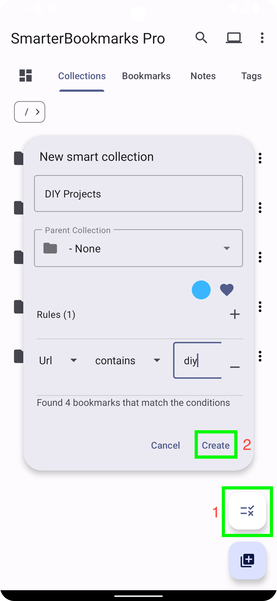
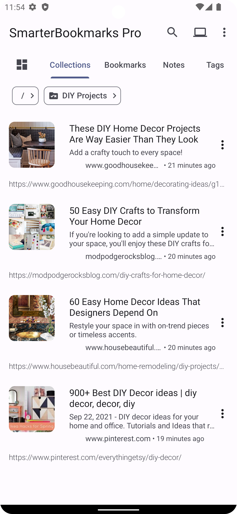

# Smart Collections

You can create Smart Collections to organize bookmarks by criteria you specify, such as URL, title, domain, or the date a bookmark was created or modified.

## Create a Smart Collection

You can create a custom Smart Collection to organize bookmarks by the criteria that you specify. Smart Collections cannot contain subfolders; bookmarks cannot be added manually to them. They can only contain bookmarks derived from the criteria you specify.

To create a Smart Collection:

1. Open the app.
2. On the "Collections" tab, click on the "Add rules" button above the "+" button.
3. Enter the name of the Smart Collection.
4. Specify the criteria for including bookmarks in the Smart Collection by adding rules
5. Set a color for the collection if desired
6. Click "Create."

Upon creation, the new Smart Collection will appear in the list of Collections.

    
    
    

## Rule types and operators

Smart Collections support powerful rules so you can precisely control which bookmarks appear.

- **OR logic:** Match bookmarks that satisfy *any* of the rules in a group.
- **NOT conditions:** Exclude bookmarks that match a rule or a whole group. The NOT operator on a group is applied correctly so results match the intended exclusion.
- **Rule grouping:** Combine rules into groups and apply AND/OR/NOT at the group level for complex logic.
- **Regex support:** Use regular expressions for URL, title, description, or domain matching.
- **Negation operators:** "Not contains," "Not starts with," and "Not ends with" for text fields.
- **Collection or subcollection:** Match bookmarks that are in a specific collection or any of its subcollections.
- **Collection name matching:** Match by collection name or subcollection name, so smart collections stay valid when you rename or recreate collections.
- **Cross-linked bookmarks:** Include bookmarks that have incoming or outgoing link relationships (Pro).
- **Health status (BROKEN):** Filter by bookmark health so you can show only broken links, only healthy links, or both (Pro; requires Bookmark Health Monitoring).
